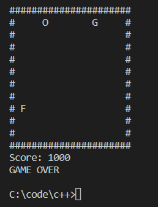

<br/>

# C++ game-snake

## main.cpp

```
The source code.
原始碼 / ソースコード
```

## Export to EXE

`c++ main.cpp -o play`

```
輸出到 EXE
EXE への書き出し
```

## play.exe

```
Window click to play.
Window 系統點擊即可玩
Window システムで play.exe クリックとゲームが起動する
```

`play.exe`

```c++
//  Setup
Initial your game state
初始化遊戲設定　/　ゲームの初設定

// Draw
Draw the view by state / logic
由狀態與邏輯畫出遊戲　/

// Input
w,s,a,d , up,down,left,right
上下左右　/　キー入力

// Logic
Moving, eating and get score, touch the wall and dead logic.
移動, 吃東西的到分數, 碰到牆壁死亡邏輯.
移動、食い物点数、壁にあったるゲームオーバーのロジック

```

I made this game by watching NVitanovic, thanks.
